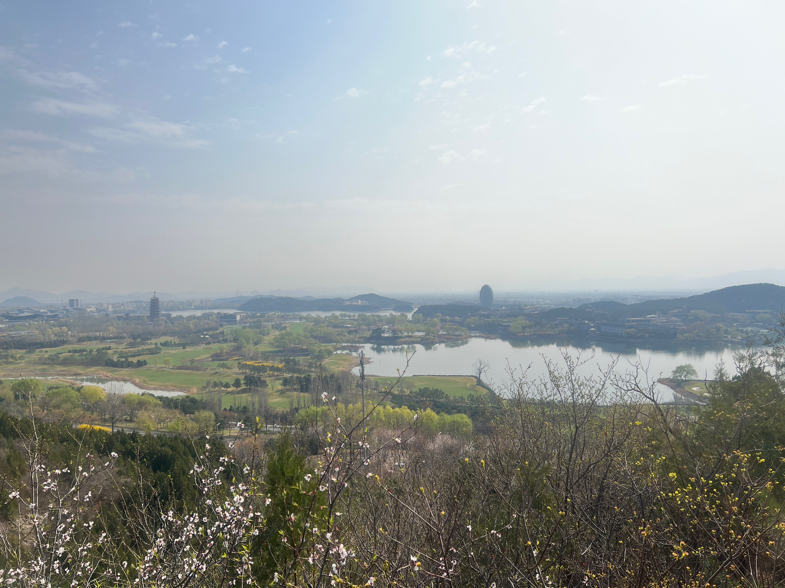
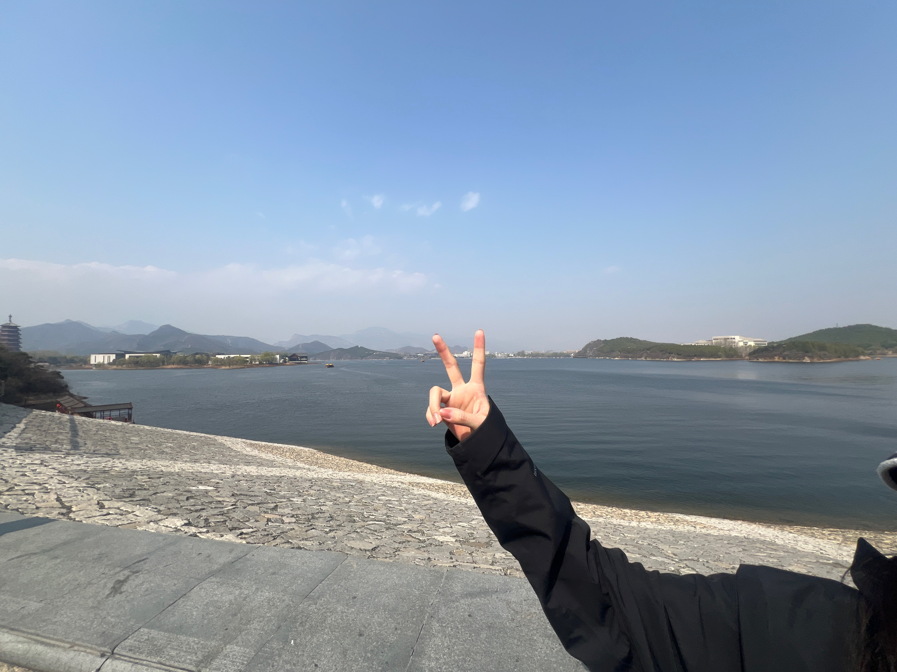
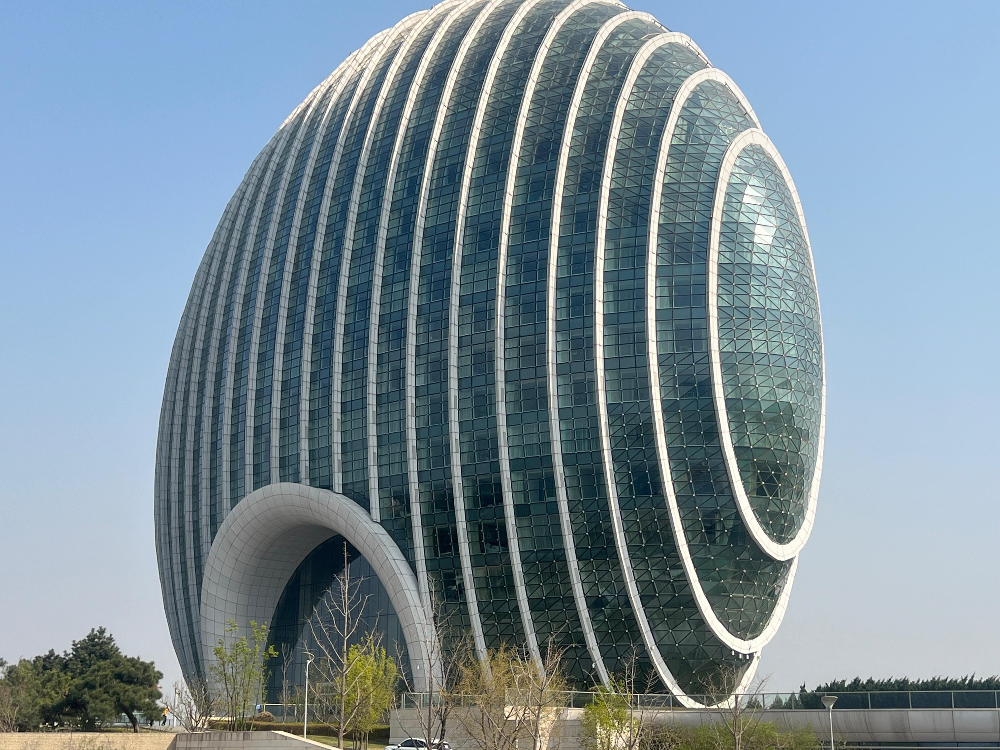

### 旅行计划

- [x] 早上七点出发取租的车
- [x] 自驾1小时10分钟到达
- [x] 上午徒步西山栈道
- [x] 中午车内吃自热米饭锅
- [x] 下午环雁栖湖骑行到4点
- [x] 4点半准备返程
  
---

### 风景照时刻

    **在西山栈道上看雁栖湖整体风景**

这个就是雁栖湖的全貌啦

    **雁栖湖的湖水**

    **小巨蛋建筑**

这个是日出东发酒店，很像一颗蛋，所以我叫他小巨蛋
